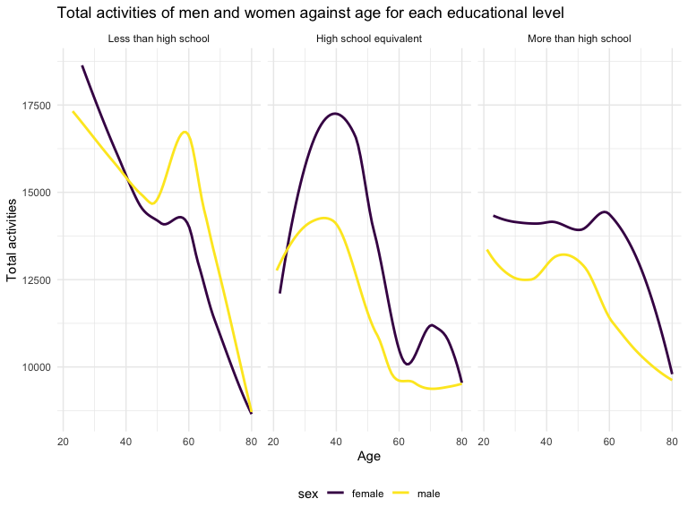

p8105_hw3_jw4348
================
Jingyu Wang
2023-10-12

## Question 1

- Description of the dataset `instacart`: This dataset contains
  **1384617** rows and **15** columns, with each row resprenting a
  single product from an instacart order. Variables include
  **identifiers for user, order, and product; the order in which each
  product was added to the cart**. There are several order-level
  variables, describing the day and time of the order, and number of
  days since prior order. Then there are several item-specific
  variables, describing the product name (e.g. Yogurt, Avocado),
  department (e.g. dairy and eggs, produce), and aisle (e.g. yogurt,
  fresh fruits), and whether the item has been ordered by this user in
  the past. In total, there are **39123** products found in **131209**
  orders from **131209** distinct users.

- A table summarizing the aisle.

``` r
instacart |> 
  count(aisle) |> 
  arrange(desc(n))
```

    ## # A tibble: 134 × 2
    ##    aisle                              n
    ##    <chr>                          <int>
    ##  1 fresh vegetables              150609
    ##  2 fresh fruits                  150473
    ##  3 packaged vegetables fruits     78493
    ##  4 yogurt                         55240
    ##  5 packaged cheese                41699
    ##  6 water seltzer sparkling water  36617
    ##  7 milk                           32644
    ##  8 chips pretzels                 31269
    ##  9 soy lactosefree                26240
    ## 10 bread                          23635
    ## # ℹ 124 more rows

- Based on the output, there are **134** aisles, with **fresh
  vegetables** and **fresh fruits** holding the most items ordered by
  far, which are **150609** items and **150473** items.

- Next is the plot of number of items ordered in each aisle.

``` r
instacart |> 
  count(aisle) |> 
  filter(n > 10000) |> 
  mutate(aisle = fct_reorder(aisle, n)) |> 
  ggplot(aes(x = aisle, y = n)) + 
  geom_point() + 
  labs(title = "Number of items ordered in each aisle") +
  theme(axis.text.x = element_text(angle = 60, hjust = 1))
```


- Next is a table showing the three most popular items in each of the
  aisles “baking ingredients”, “dog food care”, and “packaged vegetables
  fruits”.

``` r
instacart |> 
  filter(aisle %in% c("baking ingredients", "dog food care", "packaged vegetables fruits")) |>
  group_by(aisle) |> 
  count(product_name) |> 
  mutate(rank = min_rank(desc(n))) |> 
  filter(rank < 4) |> 
  arrange(desc(n)) |>
  knitr::kable()
```

| aisle                      | product_name                                  |    n | rank |
|:---------------------------|:----------------------------------------------|-----:|-----:|
| packaged vegetables fruits | Organic Baby Spinach                          | 9784 |    1 |
| packaged vegetables fruits | Organic Raspberries                           | 5546 |    2 |
| packaged vegetables fruits | Organic Blueberries                           | 4966 |    3 |
| baking ingredients         | Light Brown Sugar                             |  499 |    1 |
| baking ingredients         | Pure Baking Soda                              |  387 |    2 |
| baking ingredients         | Cane Sugar                                    |  336 |    3 |
| dog food care              | Snack Sticks Chicken & Rice Recipe Dog Treats |   30 |    1 |
| dog food care              | Organix Chicken & Brown Rice Recipe           |   28 |    2 |
| dog food care              | Small Dog Biscuits                            |   26 |    3 |

- Finally is a table showing the mean hour of the day at which Pink Lady
  Apples and Coffee Ice Cream are ordered on each day of the week.

``` r
instacart |>
  filter(product_name %in% c("Pink Lady Apples", "Coffee Ice Cream")) |>
  group_by(product_name, order_dow) |>
  summarize(mean_hour = mean(order_hour_of_day)) |>
  pivot_wider(
    names_from = order_dow, 
    values_from = mean_hour) |>
  knitr::kable(digits = 2)
```

    ## `summarise()` has grouped output by 'product_name'. You can override using the
    ## `.groups` argument.

| product_name     |     0 |     1 |     2 |     3 |     4 |     5 |     6 |
|:-----------------|------:|------:|------:|------:|------:|------:|------:|
| Coffee Ice Cream | 13.77 | 14.32 | 15.38 | 15.32 | 15.22 | 12.26 | 13.83 |
| Pink Lady Apples | 13.44 | 11.36 | 11.70 | 14.25 | 11.55 | 12.78 | 11.94 |

## Question 2

#### First I did some data cleaning:

``` r
brfss_df = brfss_smart2010 |> 
  janitor::clean_names() |> 
  rename(states = locationabbr, locations = locationdesc) |>
  filter(topic == "Overall Health", 
         response == "Excellent" | response == "Very good" |response == "Good" | response == "Fair" | response == "Poor" ) |>
  mutate(
        response = factor(response, levels = c("Poor", "Fair", "Good", "Very good", "Excellent"))
        )
```

#### Then I will create a dataframe for 2002 and 2010:

``` r
brfss_2002_df = brfss_df |> 
  filter(year == 2002) |>
  group_by(states) |> 
  count(locations)|>
  distinct() |> 
  filter(n() >= 7) |> 
  select(states) |> 
  distinct()

brfss_2010_df = brfss_df |> 
  filter(year == 2010) |>
  group_by(states) |> 
  count(locations)|>
  distinct() |> 
  filter(n() >= 7) |> 
  select(states) |> 
  distinct() 
```

- In 2002, states **CT, FL, MA, NC, NJ, PA** were observed at 7 or more
  locations. In 2010, **CA, CO, FL, MA, MD, NC, NE, NJ, NY, OH, PA, SC,
  TX, WA** were observed at 7 or more locations.

#### Next I construct a new dataset with some requirement, and then I make a plot of the average value over time for each states in some requirement:

``` r
brfss_excellent_df = brfss_df |> 
  select(states, response, data_value, year) |> 
  filter(response == "Excellent") |> 
  group_by(states, year) |> 
  summarize (
    mean_value = mean(data_value, na.rm = TRUE)
  )
```

    ## `summarise()` has grouped output by 'states'. You can override using the
    ## `.groups` argument.

``` r
  ggplot(brfss_excellent_df, aes(x = year, y = mean_value)) +
    geom_line(aes(color = states), alpha = .5) +
    labs(title = " Average value across years among states in the United States",
         x = "Year",
         y = "Mean value") +
    theme(legend.position = "right")
```


- For the dataset that is limited to **Excellent** responses, there are
  **443** rows and **3** columns.
- This plot showed the average value over years for each states who only
  response `Excellent`.
  - Most state have their average values of `Excellent` response between
    **17 to 27**.
  - All of the average value are **bumping up and down** across the
    years.

#### Next I will make a two-panel plot showing distribution of **data_value** for responses in years **2006** and **2010**:

``` r
brfss_ny_df = brfss_df |>
  filter (states == "NY",
          year == 2006 | year == 2010)

ggplot(brfss_ny_df, aes(x=data_value, fill=response)) +
  geom_density(alpha = 0.5) +
  labs(title = "Distribution of responses in NY state in year of 2006 and 2010") +
  facet_grid (.~year)
```


- This two panel plot showed distribution of value for all responses in
  year 2006 and 2010.
  - In **both 2006 and 2010**, people have **least** response of
    **poor** and **second least** response of **fair**. **Most**
    response are **above fair**. And, the **most** response is **very
    good**.
  - We have **more** people responded **excellent and good** in **2010**
    than 2006.

## Question 3

#### First I load and tidy the **accelerometer** dataset:

``` r
mims_df = read_csv("./data/nhanes_accel.csv") |> 
  janitor::clean_names() |> 
   pivot_longer(
    min1:min1440,
    names_to = "time_min",
    names_prefix = "min",
    values_to = "mims"
               )
```

    ## Rows: 250 Columns: 1441
    ## ── Column specification ────────────────────────────────────────────────────────
    ## Delimiter: ","
    ## dbl (1441): SEQN, min1, min2, min3, min4, min5, min6, min7, min8, min9, min1...
    ## 
    ## ℹ Use `spec()` to retrieve the full column specification for this data.
    ## ℹ Specify the column types or set `show_col_types = FALSE` to quiet this message.

#### Then I load and tidy the **demographic** dataset:

``` r
demo_df = read_csv("./data/nhanes_covar.csv", skip = 4) |> 
  na.omit() |> 
  janitor::clean_names() |> 
  filter(age >=  21) |> 
  mutate(
    sex = 
      case_match(
        sex, 
        1 ~ "male", 
        2 ~ "female"),
        education = ifelse(education == 1, "Less than high school", 
                       ifelse(education == 2, "High school equivalent", 
                              "More than high school")),
        education = factor(education, levels = c("Less than high school", "High school equivalent", "More than high school"))
         )
```

    ## Rows: 250 Columns: 5
    ## ── Column specification ────────────────────────────────────────────────────────
    ## Delimiter: ","
    ## dbl (5): SEQN, sex, age, BMI, education
    ## 
    ## ℹ Use `spec()` to retrieve the full column specification for this data.
    ## ℹ Specify the column types or set `show_col_types = FALSE` to quiet this message.

#### Third I combined these two tidied datasets:

``` r
comb_data = left_join(demo_df, mims_df, by = "seqn")
```

- This tidied and merged dataset contains **328320** rows and **7**
  columns.

#### Next I created a table for the number of men and women in each education category by using the tidied demographic dataset **demo_df**:

``` r
gender_df = demo_df |> 
         group_by(sex, education) |> 
         summarise(quantity = n()) |> 
         pivot_wider(
            names_from = sex,
            values_from = quantity
                    ) |> 
         knitr::kable()
```

    ## `summarise()` has grouped output by 'sex'. You can override using the `.groups`
    ## argument.

``` r
gender_df
```

| education              | female | male |
|:-----------------------|-------:|-----:|
| Less than high school  |     28 |   27 |
| High school equivalent |     23 |   35 |
| More than high school  |     59 |   56 |

- This table provides a clear breakdown of the number of individuals in
  each education category by gender.
  - The **majority** of individuals in the dataset have **“More than
    high school”** education, with 115 individuals in this category.
  - There is a **gender imbalance** in the **“High school equivalent”**
    category, with more males than females. In the other two categories,
    the gender distribution is relatively balanced.

#### Next I create a visualization of the age distributions for each gender in each education category by using the tidied demographic dataset **demo_df**:

``` r
ggplot(demo_df, aes(x = age, fill = sex)) +
  geom_histogram(binwidth = 5, position = "dodge") +  
  facet_grid (.~education) +
  labs(title = "Age distribution of female and male in each education category", 
      x = "Age",
      y = "Count") 
```


- This plot provides a clear visualization of the age distributions for
  men and women in each education category. We have three panels with
  three educations levels: **Less than high school**, **High school
  equivalent** and **More than high school**
  - There is **greater portion** of people are in the education level of
    **More than high school** compared to other education category.
    Within that, the number of **female** is **greater** than male. Both
    female and male are mostly in the age **20 to 40**, but we still
    have some people in other different age as well.
  - For people whose education is **less than high school**, female and
    male are relatively **same** number, but slightly more people are in
    the old age **60 - 80**. For people whose education is **high school
    equivalent**, we have **greater** portion of **male** than female,
    distribution is pretty **uniform** in the middle area of age, but
    **two peaks** in the age of **20s and 80s**.

#### Then I will create a dataset to aggregate across minutes to create a total activity variable for each participant. And make a plot to deacribe the total activity in different gender and different educational levels.

``` r
total_activity_df = comb_data |> 
  group_by(seqn) |> 
  mutate(total_activity = sum(mims)) |>
  select(seqn, total_activity, education, age, sex) |>
  distinct()
  
ggplot(total_activity_df, aes(x = age, y = total_activity, color = sex)) +
  geom_smooth(se=FALSE) +
  facet_grid(.~education) +
  labs(
    title = "Total activities of men and women against age for each educational level", 
    x = "Age",
    y = "Total activities"
    )
```

    ## `geom_smooth()` using method = 'loess' and formula = 'y ~ x'



- This plot provides a clear visualization of comparison of total
  activities in different genders and different educational levels.
  - For people whose educational level is **less than high school**,
    both female and male is **decreasing** their **total activity** when
    they are older. **Male** is slightly **high** in **total
    activities** in most of the age.
  - For people whose educational level is **high school equivalent**,
    they are **increasing sharply** their total activity when their ages
    increase in the range of **20 to 40**. However, **after around 40**,
    their total activity generally **decrease** when they are older.
    **Women** are generally have **greater** total activities in most of
    the age compared to men. Also, there is a **small increase** for
    **women** in total activity around age **60 to 70** against the
    decreasing pattern after 40.
  - For **women** whose educational level is **more than high school**,
    their total activities are relatively **steady high** before 60.
    **After age 60**, their total activities **decrease** when they
    aged; For **men** in same educational level, the total activity
    **increase before 45**, and **decrease after 45** when they aged.
    **Women** generally have **more** total activities than men across
    the age.

#### Finally I will make a plot to decribe 24 hours course of activity in different gender and different educational levels.

``` r
day_activity_df = comb_data |> 
  group_by(sex, education, time_min) |> 
  mutate(
    mean_activity = mean(mims),
    time_min = as.numeric(time_min)
        ) |> 
  select(sex, education, time_min, mean_activity) 
  
ggplot(day_activity_df, aes(x = time_min, y = mean_activity, color = sex)) +
  geom_point(alpha=0.1) +
  geom_smooth(se=FALSE) +
  facet_grid(.~education) +
  labs(
    title = "24-hour activity of men and women in different education level", 
    x = "Minute of a day",
    y = "Mean activities")
```

    ## `geom_smooth()` using method = 'gam' and formula = 'y ~ s(x, bs = "cs")'


- This plot provides a clear visualization of comparison of activities
  in different genders and different educational levels across 24 hours.
  - For all three educational levels, people’s one day activity are
    **mostly overlapping** regardless of gender. **Limited activity** in
    **midnight**, **increasing** activity before **noon**,
    **decreasing** activity in the **evening**. \*However, when people
    have **higher education**, they have **longer steady peaks** in
    their activity.
  - For people whose educational level is **less than high school**,
    both **female and male** have sharply decrease of activity after
    noon. Also, **women** have greater activity in the **noon**, and
    **men** have greater activity in the **evening and midnight**.
  - For people whose educational level is **high school equivalent**,
    **female** have generally **more activity** than male. Their **peak
    time of activity** at noon is much **longer** than people whose
    educational level is **less than high school**.
  - For people whose educational level is **more than high school**,
    **female** have generally **more activity** than male, even **great
    deviation**. Their **peak time** of activity at noon is **longest**
    compared to to other educational levels.
